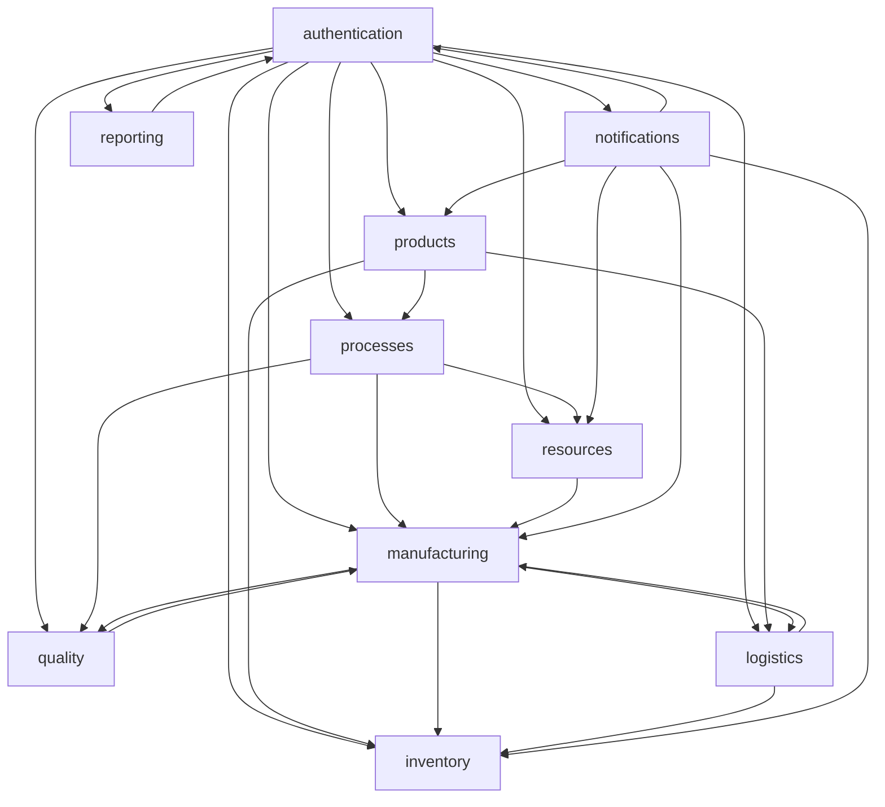

# 🏗️ Microsprings Inventory Management System - Restructured Architecture

## 📋 **Project Overview**

This project has been restructured from a monolithic approach into a well-organized, modular Django application following domain-driven design principles. The new structure aligns with the implementation phases and provides better maintainability, scalability, and developer experience.

## 🎯 **App Structure & Responsibilities**

### **Phase 1: Core Foundation**

#### 1. **`authentication/`** - User Management & Authentication
- **Purpose**: Complete user management system with role-based access control
- **Models**: `CustomUser`, `UserProfile`, `Role`, `UserRole`
- **Features**:
  - JWT-based authentication
  - Extended user profiles with employee information
  - Flexible role-based permissions system
  - Audit trail for role assignments

#### 2. **`products/`** - Product Catalog Management
- **Purpose**: Comprehensive product information and specifications
- **Models**: `MaterialType`, `ProductCategory`, `Product`, `ProductSpecification`
- **Features**:
  - Hierarchical product categories
  - Flexible material type definitions with dynamic properties
  - Version-controlled product specifications
  - Support for different units of measurement

#### 3. **`inventory/`** - Stock Management & Transactions
- **Purpose**: Real-time inventory tracking across multiple locations
- **Models**: `Location`, `InventoryTransaction`, `StockBalance`
- **Features**:
  - Multi-location inventory management
  - Universal transaction tracking with idempotency
  - Real-time stock balance calculations
  - Comprehensive audit trails

### **Phase 2: Process Management**

#### 4. **`manufacturing/`** - Production Management
- **Purpose**: Complete manufacturing order lifecycle management
- **Models**: `ManufacturingOrder`, `Batch`, `BatchProcessExecution`
- **Features**:
  - Manufacturing order planning and tracking
  - Batch-based production management
  - Process execution with operator and machine assignments
  - Real-time production metrics

#### 5. **`processes/`** - Workflow Management
- **Purpose**: Template-based process flow configuration
- **Models**: `ProcessTemplate`, `ProcessStep`, `ProcessStepDependency`, `ProductProcessMapping`
- **Features**:
  - Configurable workflow templates
  - Process step dependencies and sequencing
  - Product-to-process mapping
  - Quality check integration points

#### 6. **`resources/`** - Machine & Resource Management
- **Purpose**: Equipment scheduling and resource optimization
- **Models**: `Machine`, `MachineSchedule`
- **Features**:
  - Machine capability definitions
  - Resource scheduling and utilization tracking
  - Maintenance management
  - Capacity planning

### **Phase 3: Advanced Features**

#### 7. **`quality/`** - Quality Management & Traceability
- **Purpose**: Comprehensive quality control and traceability
- **Models**: `QualityCheckTemplate`, `QualityCheck`, `TraceabilityRecord`
- **Features**:
  - Configurable quality check templates
  - Quality inspection results tracking
  - Complete batch traceability
  - Environmental condition recording

#### 8. **`logistics/`** - Packaging & Dispatch
- **Purpose**: End-to-end logistics management
- **Models**: `PackagingType`, `PackedItem`, `DispatchOrder`
- **Features**:
  - Flexible packaging configurations
  - QR code generation for traceability
  - Dispatch order management
  - Shipping documentation

#### 9. **`notifications/`** - Alerts & Communication
- **Purpose**: Intelligent alerting and notification system
- **Models**: `AlertRule`, `Alert`, `NotificationLog`
- **Features**:
  - Configurable alert rules
  - Multi-channel notifications (email, SMS, in-app)
  - Alert acknowledgment and resolution tracking
  - Delivery status monitoring

### **Phase 4: Analytics & Integration**

#### 10. **`reporting/`** - Analytics & Business Intelligence
- **Purpose**: Data analytics and business intelligence
- **Models**: `ReportTemplate`, `ScheduledReport`
- **Features**:
  - Configurable report templates
  - Automated report scheduling
  - Role-based report access
  - Custom visualization configurations

## 🔄 **Inter-App Dependencies**

## 📊 **Model Relationships Summary**

| App | Models | Key Relationships |
|-----|--------|-------------------|
| **authentication** | 4 models | Base user system, referenced by all apps |
| **products** | 4 models | Referenced by inventory, manufacturing, logistics |
| **inventory** | 3 models | References products, manufacturing |
| **manufacturing** | 3 models | References products, processes, resources |
| **processes** | 4 models | References products, used by manufacturing |
| **resources** | 2 models | References processes, used by manufacturing |
| **quality** | 3 models | References processes, manufacturing |
| **logistics** | 3 models | References products, manufacturing, inventory |
| **notifications** | 3 models | References authentication |
| **reporting** | 2 models | References authentication |

## 🚀 **Benefits of This Structure**

### **1. Maintainability**
- **Clear separation of concerns**: Each app has a focused responsibility
- **Reduced complexity**: Smaller, manageable codebases per domain
- **Easy debugging**: Issues can be isolated to specific domains

### **2. Scalability**
- **Independent scaling**: Apps can be scaled independently
- **Microservices ready**: Easy to extract apps into separate services
- **Team collaboration**: Different teams can work on different apps

### **3. Development Experience**
- **Phase-based development**: Implement features in logical phases
- **Parallel development**: Multiple developers can work simultaneously
- **Clear dependencies**: Easy to understand inter-app relationships

### **4. Business Alignment**
- **Domain-driven design**: Apps align with business domains
- **Stakeholder communication**: Easy to map features to business areas
- **Feature planning**: Clear roadmap based on implementation phases

## 🛠️ **Development Guidelines**

### **Adding New Features**
1. Identify the appropriate app based on business domain
2. Check dependencies and ensure proper foreign key relationships
3. Update admin configurations for new models
4. Add appropriate tests for the new functionality

### **Cross-App Communication**
- Use Django's foreign key relationships for data consistency
- Implement signals for cross-app notifications
- Consider using Django's contenttypes framework for generic relationships

### **Migration Strategy**
- Each app maintains its own migrations
- Use data migrations for complex transformations
- Test migrations thoroughly in development environment

## 📈 **Implementation Roadmap**

### **Phase 1: Core Foundation** ✅
- [x] User management and authentication
- [x] Product catalog system
- [x] Basic inventory management

### **Phase 2: Process Management** ✅
- [x] Manufacturing order system
- [x] Process workflow templates
- [x] Resource scheduling

### **Phase 3: Advanced Features** ✅
- [x] Quality management system
- [x] Logistics and dispatch
- [x] Notification system

### **Phase 4: Analytics & Integration** ✅
- [x] Reporting framework
- [ ] API development
- [ ] Mobile optimization
- [ ] Advanced analytics dashboards

## 🔧 **Technical Stack**

- **Backend**: Django 5.2.6 with Django REST Framework
- **Database**: SQLite (development) / PostgreSQL (production)
- **Authentication**: JWT with djangorestframework-simplejwt
- **Admin Interface**: Django Admin with custom configurations
- **API**: RESTful APIs with DRF

## 📝 **Next Steps**

1. **API Development**: Create comprehensive REST APIs for each app
2. **Frontend Integration**: Develop React/Vue.js frontend
3. **Testing**: Implement comprehensive test suites
4. **Documentation**: Create API documentation with Swagger
5. **Deployment**: Set up CI/CD pipeline and production deployment

This restructured architecture provides a solid foundation for building a comprehensive, scalable inventory management system that can grow with your business needs.
